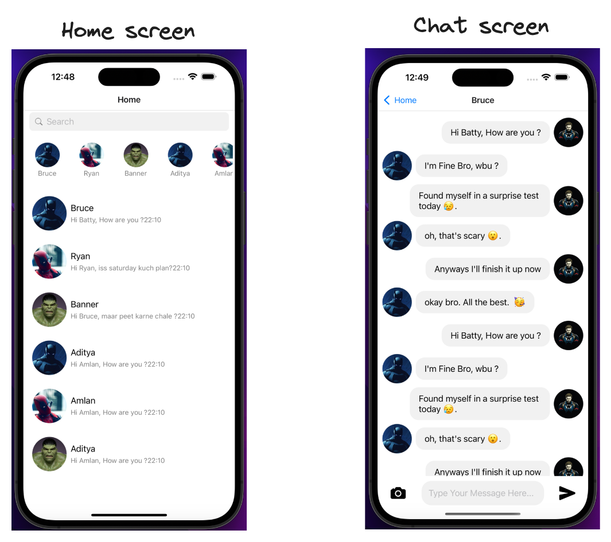

# Chat App - React Native

The purpose of the react-native chat app is primarily to demonstrate the inner workings of Redux in the context of a React Native application. The app showcases a visually appealing user interface with various features that have been implemented using Redux for state management.

Note : It's not an actual chat-app. It uses dummy json data.

